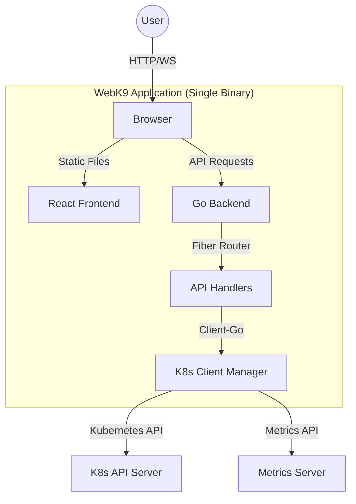

# WebK9 🚀

WebK9 is a powerful, web-based Kubernetes dashboard inspired by `k9s`. It provides a sleek, modern interface to manage multiple clusters, switch contexts effortlessly, and monitor resource usage with real-time updates.


## ✨ Features

-   **Multi-Cluster Management**: Effortlessly browse and switch between multiple kubeconfig files and contexts.
-   **Real-time Monitoring**: Live streaming of Pods, Nodes, Namespaces, and more using WebSockets.
-   **Metrics Integration**: Visualized CPU and Memory usage for Pods and Nodes.
-   **In-Browser CLI**: Direct shell access to containers (Exec) and log streaming.
-   **Portable & Fast**: A single binary deployment with an embedded React frontend.
-   **Cross-Platform**: Release builds available for Linux, macOS, and Windows.

---

## 🏗 Architecture

WebK9 is built with a decoupled architecture focusing on performance and ease of deployment.

### System Overview



### Backend (Go + Fiber)
-   **Fiber Framework**: High-performance HTTP server for routing and middleware.
-   **K8s Client-Go**: Robust interaction with Kubernetes clusters via the official client.
-   **Static Embedding**: Frontend assets are compiled into the binary using `go:embed`.
-   **Safe Config Loading**: Defensive multi-context loading with automatic fallback for invalid `current-context` settings.

### Frontend (React + Vite)
-   **Vite**: Lightning-fast build tool and dev server.
-   **Xterm.js**: High-performance terminal emulator for pod shell access.
-   **TailwindCSS (Wait, actually Vanilla CSS)**: Custom premium design tokens for a "WOW" aesthetic.
-   **WebSocket Streaming**: Real-time resource updates for a lag-free experience.

---

## 🚀 Quick Guide for Users

### Prerequisites
-   Go 1.21+
-   Node.js 20+ (for developers)
-   Pnpm (for developers)

### Running the App
#### Linux / macOS
1.  **Download any pre-built binary** from the releases.
2.  **Execute**:
    ```bash
    ./web-k9
    ```
3.  **Open Browser**: Navigate to `http://localhost:3030`.

#### Windows
1.  **Download** `web-k9-windows-amd64.exe` from the releases.
2.  **Open PowerShell** or Command Prompt.
3.  **Run**:
    ```powershell
    .\web-k9-windows-amd64.exe
    ```
4.  **Open Browser**: Navigate to `http://localhost:3030`.

---

## 🛠 Developer Guide

### Project Structure
```text
.
├── backend/            # Go source code
│   ├── pkg/
│   │   ├── handlers/   # API & WebSocket handlers
│   │   └── k8s/        # K8s client manager logic
│   └── main.go         # Entry point & static embedding
├── frontend/           # React source code (Vite)
│   ├── src/
│   │   ├── components/ # UI Components
│   │   └── services/   # API & WS services
│   └── vite.config.ts  # Build & chunking configuration
├── Makefile            # Development build script
└── Makefile.release    # Cross-platform release script
```

### Development Workflow
1.  **Start Frontend Dev**:
    ```bash
    cd frontend && pnpm dev
    ```
2.  **Start Backend**:
    ```bash
    cd backend && go run main.go
    ```

### Release Builds
To build for all supported systems (Linux, macOS, Windows):
```bash
make -f Makefile.release release
```
This command will:
1.  **Build the Frontend**: Compile the React application into production assets.
2.  **Cross-Compile**: Generate specialized Go binaries for multiple architectures and operating systems.
3.  **Output**: All binaries are placed in the `release/` directory.

### Build Commands Reference
| Target | Command | Result |
| :--- | :--- | :--- |
| **Development Build** | `make build` | Local binary (`web-k9`) |
| **Linux (amd64)** | `make -f Makefile.release linux-amd64` | `release/web-k9-linux-amd64` |
| **Mac (arm64)** | `make -f Makefile.release darwin-arm64` | `release/web-k9-darwin-arm64` |
| **Windows (amd64)** | `make -f Makefile.release windows-amd64` | `release/web-k9-windows-amd64.exe` |

### Creating a Windows Installer
To create a standard `.exe` installer (setup file) with Start Menu shortcuts and uninstaller:

**Prerequisites**: Install NSIS (Nullsoft Scriptable Install System).
- **Linux (Debian/Ubuntu)**: `sudo apt-get install nsis`
- **Windows**: Download from [nsis.sourceforge.io](https://nsis.sourceforge.io/Download)

**Build Command**:
```bash
make -f Makefile.release installer
```
This will generate `release/WebK9_Setup.exe`.

---

## 🤝 Contributing
Contributions are welcome! Please feel free to submit a Pull Request.

## 📝 License
MIT
